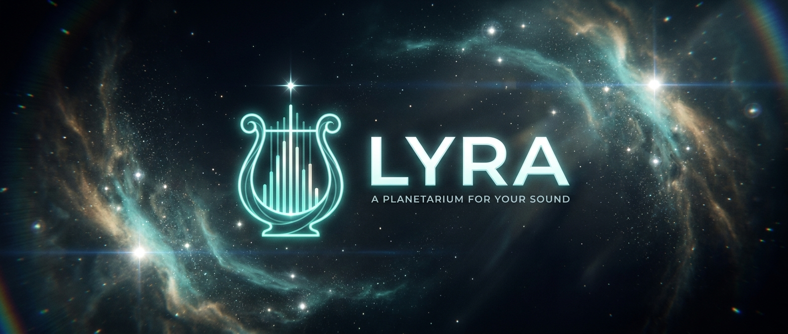

# LYRA — v1.0.0 · "First Light"

*A planetarium for your sound*

LYRA leaves alpha. **This is the first full release** and it grows beyond the app window. Because now, LYRA can now be your **stream overlay** and your **desktop wallpaper**, on top of the music visualizer you already know.

---

## ✦ NEW Stream Overlay Studio (OBS / Streamlabs)

Put LYRA on your stream with **one transparent browser source**

- The overlay server only runs when you turn it on in **Settings → Overlay**. While it's on, LYRA's own window stops its visualisation due to low performance users.
- **IMPORTANT** OBS makes worse the browser sources unless you enable a custom frame rate. If the overlay looks laggy and low frame rate, right-click the source you created in your obs scene → **Properties** → **"Use custom frame rate" → 60 FPS**. LYRA detects a throttled source and shows this reminder right inside it
- **Fully customizable:** new overlay feature allows you to place the now-playing card anywhere, put effects on any screen edge (1-4 sides of your screen)
- **Donation alerts** with built in or custom sounds, the visuals react to the alert sound, then return to the music. Reacts with them from Streamlabs / StreamElements / a Stream Deck via a simple local endpoint, or the built-in test button.
- **Microphone reactivity (beta)** effects react to what gets spoken into your mic.
- **Custom text widgets** add your handle, headers, anything, in any color / size / glass.

It might not work smoothly if you minimize LYRA.
You do NOT have to have the URLS open in your browser.

## ✦ NEW desktop wallpaper (Windows)

Run LYRA **behind your desktop icons**

- **LYRA Settings → Wallpaper → On.** It renders as your desktop, reacting to whatever's playing, same as in LYRA app.
- **Monitor picker:** a single monitor, a selected span, or all of them.
- **Always escapable:** a global hotkey (**Ctrl+Alt+L**) to exit
- **Power-friendly:** when a fullscreen app/game is in front, reduces the frame rate.$

## ✦ Also

- **6 languages** — English / Spanish / German / French / Portuguese / Italian
- **Cast to TV** (Chromecast / Android-TV built in receiver, nothing to install on the TV)

## ✦ Controls

| Key | Action |
|-----|--------|
| `G` / `N` | (SCENES) Galaxy / Nebula |
| `1` / `2` / `3` | Quality tier ( in particles) — 250k / 500k / 1,000k |
| `R` | Re acquire the audio device |
| `C` | Cast to TV on/off |
| `D` | **DEBUG** audio analysis overlay (now with fps) |
| `S` | **DEBUG** Shows track change transition on the scene |
| `I` | **DEBUG** Shows beat drop impulse on current scene |
| **`Ctrl`+`Alt`+`L`** | Exit wallpaper mode (global) |

## ✦ Notes

-`LYRA.exe` is a single self extracting portable. Download it, double-click, enjoy.
- Requires Windows 10 / 11, 64-bit, with a WebGPU-capable GPU and latest drivers.
- Now playing (title, artist, album art + per-album color) still works with **any** media app on Windows and no login and no Spotify Premium required anymore. Spotify is simply prioritised when it's open.
## ✦ Install

Download **`Setup.exe`** from the release.
Run it. (It's an assisted installer=

> Windows may show a SmartScreen notice ("Windows protected your PC") because the app is unsigned. click **More info → Run anyway**.

**Requirements:** Windows 10 / 11 64-bit, a WebGPU-capable GPU with current drivers (older GPUs can drop to a lower particle tier / render resolution in Settings)
---

*LYRA is an independent, non commercial project made for fun. Not affiliated with, endorsed by, or sponsored by Spotify or anyone else.*

