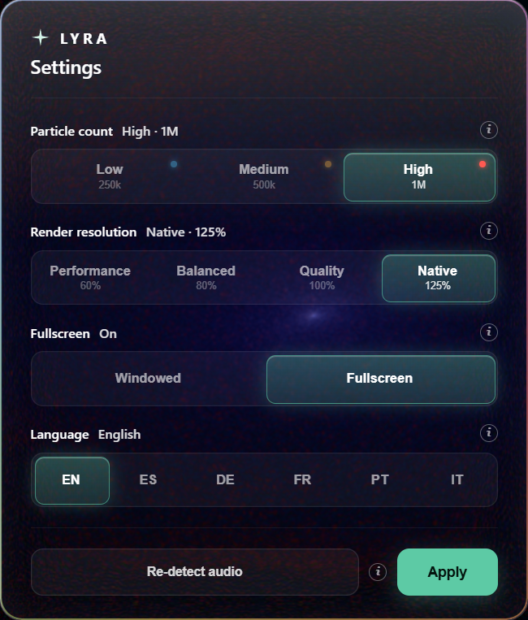

# LYRA

A windows runtime, GPU driven music visualizer that turns whatever you're listening to into an animation.

> **LYRA is a private, for fun project. It is _not_ affiliated with, endorsed by, or sponsored by Spotify or anyone else**
> See the [Disclaimer](#disclaimer) below.

Release notes: [PATCHNOTES-v1.0.0.md](PATCHNOTES-v1.0.0.md)

---

## ✦ What it is

LYRA listens to your **system audio** so it reacts to anything you currently play as sound and renders up to **1 million GPU particles** that move with the music's detected beats, drops and stems. It also reads the current song straight from **Windows** (title, artist and album cover), and recolors the whole scene to match each album color.

Pick a scene and press play on anything:

- **Nebula**
- **Supercluster**

## ✦ Revamp

The redesigned, liquid glass Settings panel:

The control dock and the now playing card:

## ✦ Stream Overlay Studio (OBS / Streamlabs)

Put LYRA on your stream with **one transparent browser source**. Open the **LYRA Overlay Studio**, design it (now-playing card + a scene of your choice, any colours/layout, donation alerts, beta mic voice reactions, custom text), then press **Copy OBS URL**, and paste it into OBS or other streaming services. It reacts to the song via LYRA's own beat detection and keeps working with LYRA.
You might find issues if you minimize LYRA while this feature is on.

The overlay is **off by default** flip it on in **LYRAs Settings → Overlay**. While it's on, LYRA's own window shows a "stream overlay is running" notice so you know.

> **Low frame rate in OBS?** That's an OBS default, not LYRA. Right-click the Browser Source you created in OBS → **Properties** → confirm that **"Use custom frame rate"** is on and set it to **60 FPS**

## ✦ Live desktop wallpaper (Windows)

**LYRAs Settings → Wallpaper → On** renders LYRA behind your desktop icons. Pick one monitor or multiple or a span across all your monitors; you can exit the feature with **Ctrl+Alt+L**; feature doesnt affect your gameplay, it reduces frame rate when a full windowed app/game is open.

## ✦ No login, no Spoti Premium

LYRA reads the current track from **Windows System Media Transport Controls (SMTC)** the same source as the little media popup on your volume flyout.

## ✦ Languages

The interface is available in **English, Spanish, German, french, Portugues and italian**. LYRA follows your Windows language automatically, and you can switch any time in **Settings → Language**.

## ✦ Requirements

- **Windows 10 / 11, 64-bit**
- A **WebGPU-capable GPU** with latest drivers (developed on NVIDIA RTX hardware and older GPUs can decrease to a lower particle tier and render resolution in Settings)
- Any audio source. that's it.

## ✦ Made With

## ✦ Install

Download **`Setup.exe`** from the [Releases](https://github.com/ShrezesUverse/LYRA-Music-Visualizer/releases)
RIts an assisted installer (choose a location, optional desktop shortcut)

> Windows may show a SmartScreen warning ("Windows protected your PC") because the app is unsigned. Click **More info → Run anyway**

## ✦ Controls

Everything can be changed in the dock at the bottom of the window, but...

| Key | Action |
|-----|--------|
| `G` / `N` | (Scenes)Galaxy / Nebula |
| `1` / `2` / `3` | Quality tier (particles) — 250k / 500k / 1,000k |
| `R` | Re acquire the audio device |
| `C` | Cast to TV on/off |
| `D` | DEBUG. Toggle the audio analysis overlay (with fps) |
| `Ctrl`+`Alt`+`L` | Exit wallpaper mode (global) |

## ✦ Built with

- [Electron](https://www.electronjs.org/) + [electron-vite](https://electron-vite.org/) + TypeScript
- [three.js](https://threejs.org/) `r184` — **WebGPU renderer** + **TSL** (Three.js Shading Language), with GPU compute particles
- A custom AudioWorklet spectral flux beat/onset detector
- A small native helper that reads Windows now playing via SMTC

## ✦ Privacy

Your info isn't shared. LYRA makes no network calls for now playing feature and only writes a local log to `%AppData%/lyra/lyra.log`.

---

## Disclaimer

LYRA is an **independent, non commercial fun made project** made for fun. It is **not affiliated with, endorsed by, sponsored by, or connected to Spotify or anyone else** in any way.

"Spotify" and the Spotify logo are trademarks of **Spotify AB**. LYRA reads now playing information from Windows' own media APIs, it does not log into, modify, redistribute, or stream Spotify content. All trademarks are the property of their respective owners.

---

A few tracks that look great in LYRA:)

- [OUTTAHISMIND — Daniel Allan, Port London](https://open.spotify.com/track/65fPnec9ZIWi4YSMYOQXRm)
- [Von Dutch — Charli xcx](https://open.spotify.com/track/3Y1EvIgEVw51XtgNEgpz5c)

Enjoy ✦
