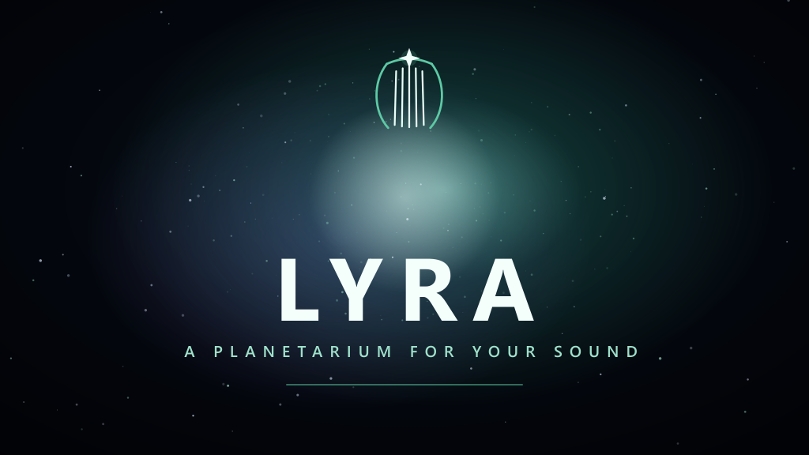
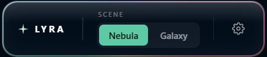
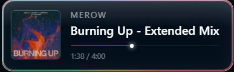

# LYRA

A windows runtime, GPU driven music visualizer that turns whatever you're listening to into an animation.

> **LYRA is a private, for fun project. It is _not_ affiliated with, endorsed by, or sponsored by Spotify or others**
> See the [Disclaimer](#disclaimer) below.

---

## ✦ What it is

LYRA listens to your **system audio** so it reacts to anything you currently play as sound and renders up to **1 million GPU particles** that move with the music's detected beats, drops and stems. It also reads the current song straight from **Windows** (title, artist and album cover), and recolors the whole scene to match each album color.

Pick a scene and press play on anything:

- **Nebula**
- **Supercluster**

Latest release notes: [PATCHNOTES-v0.4.0-ALPHA.md](PATCHNOTES-v0.4.0-ALPHA.md)

## ✦ Revamp

The redesigned, liquid glass Settings panel:

The control dock and the now playing card:

## ✦ No login, no Spoti Premium

LYRA reads the current track from **Windows System Media Transport Controls (SMTC)** the same source as the little media popup on your volume flyout.

## ✦ Languages

The interface is available in **English, Spanish, German, french, Portugues and italian**. LYRA follows your Windows language automatically, and you can switch any time in **Settings → Language**.

## ✦ Requirements

- **Windows 10 / 11, 64-bit**
- A **WebGPU-capable GPU** with latest drivers (developed on NVIDIA RTX hardware and older GPUs can decrease to a lower particle tier and render resolution in Settings)
- Any audio source. that's it.

## ✦ Running it

LYRA ships as a single **portable executable**.

1. Take `LYRA.exe` from the [Releases](https://github.com/ShrezesUverse/LYRA-Music-Visualizer/releases) page.
2. Double click it. enjoy!
3. Press play on anything

> Windows may show a SmartScreen warning ("Windows protected your PC") because the app is unsigned. Click **More info → Run anyway**

## ✦ Controls

Everything can be changed in the dock at the bottom of the window, but...

| Key | Action |
|-----|--------|
| `G` / `N` | (Scenes)Galaxy / Nebula |
| `1` / `2` / `3` | Quality tier (particles) — 250k / 500k / 1,000k |
| `R` | Re acquire the audio device |
| `D` | Toggle the audio-analysis debug overlay (with fps) |

## ✦ Built with

- [Electron](https://www.electronjs.org/) + [electron-vite](https://electron-vite.org/) + TypeScript
- [three.js](https://threejs.org/) `r184` — **WebGPU renderer** + **TSL** (Three.js Shading Language), with GPU compute particles
- A custom AudioWorklet spectral flux beat/onset detector
- A small native helper that reads Windows now playing via SMTC

## ✦ Privacy

Your info doesnt get shared. LYRA only writes a local log to `%AppData%/lyra/lyra.log`

---

## Disclaimer

LYRA is an **independent, non-commercial hobby project** made for fun. It is **not affiliated with, endorsed by, sponsored by, or connected to Spotify** in any way.

"Spotify" and the Spotify logo are trademarks of **Spotify AB**. LYRA reads now-playing information from Windows' own media APIs — it does not log into, modify, redistribute, or stream Spotify content. All trademarks are the property of their respective owners.

---

A few tracks that look great in LYRA:

- [OUTTAHISMIND — Daniel Allan, Port London](https://open.spotify.com/track/65fPnec9ZIWi4YSMYOQXRm)
- [Von Dutch — Charli xcx](https://open.spotify.com/track/3Y1EvIgEVw51XtgNEgpz5c)

Enjoy ✦
